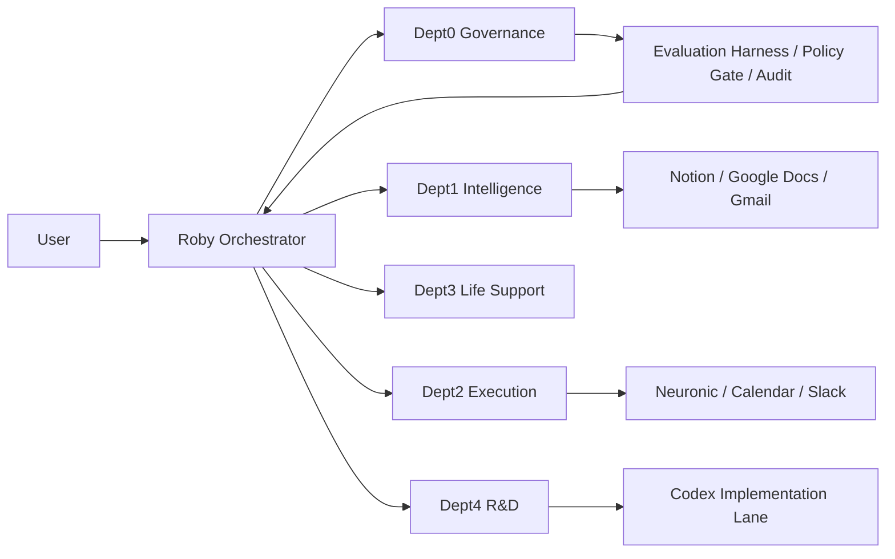

# PBS v0.9 仕様書（最新版 / OSS込み）

## 1. 目的

- あなたの仕事/生活の実行速度を上げる「自律型AIワーカー」を構築する。
- 中核は `Neuronic`。情報取得→要約→タスク化→登録→改善まで一気通貫で回す。
- 対象は個人運用（商用化は次フェーズで検討）。

## 2. 設計原則

- `Quality First, Speed Second, Cost Third`
- `Local First` は方針であり、品質・遅延を悪化させる場合はクラウド優先に切替。
- 自動化変更は `Sandbox -> Test -> Canary -> Rollback` を必須化。
- 全変更を監査可能にする（Immutable Audit方針）。

## 3. 全体アーキテクチャ

## 4. 部門定義

- Dept0 Governance: 監査、評価、ポリシー判定、改善提案。
- Dept1 Intelligence: 入力処理（議事録/Gmail/情報収集の構造化）。
- Dept2 Execution: タスク分解、Neuronic連携、通知実行。
- Dept3 Life Support: 死活監視、運用リマインド、保守。
- Dept4 R&D: 実装・改修（コード変更）。

## 5. モデル分担

- QA/相談: Gemini（高速・低コスト）
- コーディング実装: Codex
- 定型ローカル処理: Ollama系（負荷に応じて）
- ルーティングは Orchestrator がメッセージ意図で決定

## 6. 主要業務フロー

- フローA: Notion + Google Docs議事録収集 → 要約 → タスク抽出 → タスク細分化 → Neuronic Upsert
- フローB: Gmail仕分け → 要返信/要確認/アーカイブ判定 → 必要時Neuronic登録 → Slack通知
- フローC: 自己成長（レビュー → 実装候補 → テスト → 反映判定）

## 7. Neuronic連携仕様（確定）

- 送信方向: Roby → Neuronic（一方向）
- Upsertキー: `source + origin_id`
- 親子: `parent_origin_id`
- 順序: `sibling_order`
- 監視: `created / updated / skipped / errors / hierarchy_applied / order_applied`
- バッチ過大時は分割送信

## 8. OSS採用方針（最新版）

- Tier A（本番可）: React Flow, Mermaid, OTel Collector, Promptfoo, OPA, Langfuse（条件付き）
- Tier B（PoC→昇格）: LiteLLM, immudb, Prefect, n8n（限定用途）
- Tier C（検証のみ）: 実験OSS（本番不可）

## 9. OSSセキュリティ要件（悪質仕込みプロンプト対策）

- 固定コミットSHA、SBOM、SCA、ライセンス確認を必須化
- `prompts/`, `*.md`, `AGENTS.md` など指示コンテンツを静的レビュー
- `postinstall`、外部通信、任意実行の重点監査
- 最小権限サンドボックス検証後に昇格
- 昇格条件は Canary 通過 + ログ監査合格

## 10. 運用・監視

- スケジュール入口は Orchestrator に統一
- 自動実行ジョブは恒久cron化
- GitHub Projectは `WIP=1`（In Progress最大1件）
- 週次レビュー30分で `Done / Blocked / Next` を固定

## 11. 90点超え条件（必須）

- Evaluation Harness
- AB Router
- Runbook整備
- Immutable Audit

## 12. 成果指標（KPI）

- タスク抽出精度（Precision / Recall）
- 自動処理成功率（minutes / gmail / self_growth）
- 平均処理遅延（P50/P95）
- 1実行あたりコスト
- MTTR（復旧時間）

## 13. 既知リスクと対策

- リスク: ローカル偏重で品質/遅延が悪化
  - 対策: AB Routerで動的切替
- リスク: 自動改修の暴走
  - 対策: Policy Gate + Canary + Auto Rollback
- リスク: OSS供給連鎖リスク
  - 対策: Allowlist階層、署名/固定、隔離検証

## 14. 現在の実装到達点

- Orchestrator経由cron（self_growth / minutes_sync / gmail_triage）稼働
- Gmail仕分けルール運用
- Neuronic連携（Upsert / 親子順序）実装
- GitHub Project運用基盤（テンプレ、WIP=1、週次運用）整備

## 15. 次の実装順（推奨）

1. #5 Minutes抽出精度改善
2. #1 UI結果表示改善
3. #2 添付画像のOrchestrator対応
4. #8 Evaluation Harness
5. #9 AB Router
6. #7 Immutable Audit
7. #10 Runbook/Drill完成
